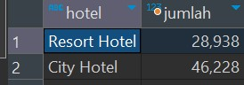
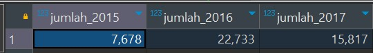
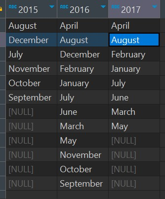
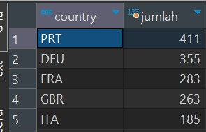
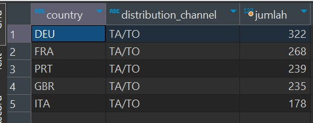
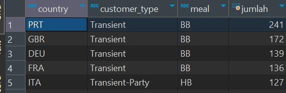
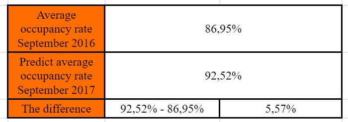

# capstone_revou

| Name           | University       | Role     |
| ---            | ---        | ----------|
| M. Fairuz Ramadhani | Universitas  Sriwijaya | Project Leader |
| Rr. Diajeng Alfisyahrinnisa Anandha | Institut Teknologi Sepuluh Nopember | Data Cleaner |
| Vania Faustina G | Sekolah Tinggi Ilmu Komputer Malang | Data Cleaner |
| Setyo Harry Nugroho | Universitas Muhammadiyah Sumatera Utara  | Data Analyst |
| Ario Nugraha R. | Universitas Indonesia | Data Communication |
| Alvian Nur Firdaus | Politeknik Negeri Malang | Data Communication |


# Dataset
https://www.kaggle.com/datasets/jessemostipak/hotel-booking-demand/data

# Cleaning with MYSQL and Python

## 1. Membandingkan jumlah resort hotel dan city hotel untuk menentukan fokus kita, apakah ingin fokus ke resort hotel ataukah ke city hotel

### Syntax mysql:

```
select 
	hb.hotel, count(hb.`index`) as jumlah
from hotel_bookings hb 
where hb.is_canceled = 0
group by hb.hotel
```

### Hasil: 
<br></br>

> Kesimpulan: karena jumlah data di City Hotel lebih banyak daripada data di Resort Hotel, maka kita fokus ke City Hotel

## 2. Membuat fix table khusus untuk city hotel dan hanya data yang `is_cancelled = 0`. 

### Disini juga kita buat `arrival_date` berdasarkan arrival_date_year, arrival_date_month, dan arrival_date_day_of_month

### Syntax mysql:

```
create table city_hotel_checkin as(
	select 
		hb.`index`, hb.hotel, hb.is_canceled, hb.lead_time, hb.arrival_date_year, hb.arrival_date_month, hb.arrival_date_week_number,
		hb.arrival_date_day_of_month,
		STR_TO_DATE(CONCAT(hb.arrival_date_year, '-', hb.arrival_date_month, '-', hb.arrival_date_day_of_month), '%Y-%M-%d') as arrival_date,
		hb.stays_in_weekend_nights, hb.stays_in_week_nights, hb.adults, hb.children, hb.babies, hb.meal, hb.country,
		hb.market_segment, hb.distribution_channel, hb.is_repeated_guest, hb.previous_cancellations, hb.previous_bookings_not_canceled,
		hb.reserved_room_type, hb.assigned_room_type, hb.booking_changes, hb.deposit_type, hb.agent, hb.company,
		hb.days_in_waiting_list, hb.customer_type, hb.adr, hb.required_car_parking_spaces, hb.total_of_special_requests,
		hb.reservation_status, hb.reservation_status_date
	from hotel_bookings hb
	where hb.hotel = 'City Hotel' and hb.is_canceled = 0
)
```

## 3. Cek data per tahun untuk mengetahui berapa jumlah data per tahunnya untuk jadi acuan analisis

### Syntax mysql:

```
select 
	sum(case when chc.arrival_date_year = 2015 then 1 else 0 end) as jumlah_2015,
	sum(case when chc.arrival_date_year = 2016 then 1 else 0 end) as jumlah_2016,
	sum(case when chc.arrival_date_year = 2017 then 1 else 0 end) as jumlah_2017
from city_hotel_checkin chc
```

### Hasil: 
<br></br>

### Selain itu, kita ingin mengetahui bulan apa saja yang telah terdapat di dataset per tahunnya

```
WITH ranked_data AS (
    SELECT 
        chc.arrival_date_month AS bulan, 
        chc.arrival_date_year AS tahun,
        ROW_NUMBER() OVER (PARTITION BY chc.arrival_date_year ORDER BY chc.arrival_date_month) AS row_num
    FROM city_hotel_checkin chc
    GROUP BY chc.arrival_date_month, chc.arrival_date_year
)
SELECT 
    MAX(CASE WHEN tahun = 2015 THEN bulan END) AS '2015',
    MAX(CASE WHEN tahun = 2016 THEN bulan END) AS '2016',
    MAX(CASE WHEN tahun = 2017 THEN bulan END) AS '2017'
FROM ranked_data
GROUP BY row_num;
```

### Hasil:
<br></br>

> Kesimpulan: karena data di tahun 2017 hanya mencapai bulan agustus, kita dapat memprediksi kenaikan occupancy rate berdasarkan data september 2016 untuk mendapatkan prediksi occupancy rate untuk september 2017

## 4. Mengambil banyak arrival per tahun 2016 dan tahun 2017

### Syntax tahun 2016:

```
create table arrival_city_2016 as (
select
	chc.arrival_date, 
	DAYNAME(chc.arrival_date) as hari_arrival,
	count(*) as jumlah_arrival_per_hari
from city_hotel_checkin chc
where chc.arrival_date_year = 2016
group by chc.arrival_date
)
```

### Syntax tahun 2017:

```
create table arrival_city_2017 as (
select
	chc.arrival_date, 
	DAYNAME(chc.arrival_date) as hari_arrival,
	count(*) as jumlah_arrival_per_hari
from city_hotel_checkin chc
where chc.arrival_date_year = 2017
group by chc.arrival_date
)
```

## 5. Menjalankan script python untuk mendapatkan total banyak orang yang menginap di hotel berdasarkan tanggalnya dan lama menginapnya

### Memanggil function:

```
def update_tgl(tgl, tanggal, lama_nginap):
    
    if lama_nginap == 0:

        tgl[tanggal] += 1

    else:
        for i in range(lama_nginap):
            tgl_update = tanggal + timedelta(days=i)

            if tgl_update in tgl:
                tgl[tgl_update] += 1
            else:
                tgl[tgl_update] = 1

def get_query_2():
    query_pertama = get_query()

    for x in query_pertama:
        update_tgl(tgl, x['tanggal'], x['lama_nginap'])
```

> Dari kode python diatas, function update_tgl akan memperhitungkan per-harinya ada berapa orang yang sedang menginap

## 6. Menggabungkan hasil tabel arrival_city dengan banyak_orang_city per tahunnya menjadi rekap_city:

### Untuk tahun 2016:

```
create table rekap_city_2016 as (
select
	boc.tanggal,
	dayname(boc.tanggal) as hari,
	boc.jumlah as banyak_orang, ac.jumlah_arrival_per_hari as banyak_arrival
from banyak_orang_city_2016 boc 
left join arrival_city_2016 ac on ac.arrival_date = boc.tanggal 
)
```

### Untuk tahun 2017:

```
create table rekap_city_2017 as (
select
	boc.tanggal,
	dayname(boc.tanggal) as hari,
	boc.jumlah as banyak_orang, ac.jumlah_arrival_per_hari as banyak_arrival
from banyak_orang_city_2017 boc 
left join arrival_city_2017 ac on ac.arrival_date = boc.tanggal 
)
```

## 7. Melihat top 5 countries yang visit city hotel di September 2016 untuk memperkirakan bahwa top 5 countries ini juga akan menginap di September 2017

### Syntax mysql:
```
select chc.country,
	count(chc.`index`) as jumlah
from city_hotel_checkin chc 
where chc.arrival_date_year = 2016 and chc.arrival_date_month = 'September'
group by chc.country
order by jumlah desc
limit 5;
```

### Hasil:
<br></br>

## 8. Melihat top 5 distribution channel based on country pada September 2016

### Syntax mysql:
```
select
	chc.country, chc.distribution_channel,
	count(*) as jumlah
from city_hotel_checkin chc 
where chc.arrival_date_year = 2016 and chc.arrival_date_month = 'September'
group by chc.country, chc.distribution_channel 
order by jumlah desc
limit 5;
```

### Hasil:
<br></br>

## 9. Melihat top 5 meal based on country and customer type pada September 2016

### Syntax mysql:

```
select 
	chc.country, chc.customer_type, chc.meal, count(chc.`index`) as jumlah
from city_hotel_checkin chc 
where chc.arrival_date_year = 2016 and chc.arrival_date_month = 'September'
group by chc.country, chc.customer_type, chc.meal
order by jumlah desc
limit 5;

```

### Hasil:
<br></br>

# Analisis berdasarkan hasil cleaning

## Analisis occupancy rate:

<br></br>

> Dari hasil analisis, kita dapat prediksi bahwa kenaikan occupancy rate di September 2017 sebanyak `5.57%` berdasarkan data dari September 2016

## Analisis dan rekomendasi untuk top 5 countries yang visit city hotel pada September 2016

### Hasil: 
<br></br>

Didapatkan hasil bahwa portugal, germany, france, united kingdom, dan italy merupakan country yang paling banyak mengunjungi city hotel pada September 2016. 

### Saran:
Untuk itu, kita dapat memberikan `promo` kepada negara-negara tersebut agar kembali ramai mengunjungi City Hotel pada September 2017

## Analisis dan rekomendasi untuk top distribution channel based on country pada September 2016

### Hasil:
<br></br>

Dari gambar diatas, dapat dilihat bahwa dari berbagai negara tersebut, mereka melakukan booking di city hotel melalui `Travel Agents/Tour Operators`. 

### Saran:
Kita dapat mempererat partnerships dengan Travel Agents atau Tour Operators dengan memberikan diskon dan promo-promo menarik agar kerjasama antara City Hotel dengan TA/TO dapat semakin erat

## Analisis dan rekomendasi untuk top booking packages based on country and customer type pada September 2016

### Hasil:
<br></br>

Dari gambar diatas, dapat dilihat bahwa most guests dari Portugal, United Kingdom, Germany, dan France prefer untuk memilih Bed and Breakfast (BB) package. Sedangkan, untuk Italy lebih prefer Half Board (HB) package

### Saran:
Jalin kerjasama dengan agen perjalanan yang populer di negara-negara tersebut untuk mempromosikan paket BB dan HB. Selain itu, kita dapat memberikan diskon untuk pemesanan paket BB dan HB